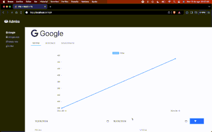

# README File

Proyecto simple para el desarrollo de una app web que consume datos de diferentes servicios publicos.

## Iniciar el proyecto local

Para iniciar el proyecto, es necesario tener **node** y **npm** o **yarn** preferentemente para levantar el servicio

instalar las dependencias

```js
  npm install
```

iniciar el servicio

```js
  npm dev
```

Este iniciará el servicio en:

> http://localhost:5173

## Vista general



## Herramientas principales

1. React, para crear componentes
2. Typescript, tipado de datos y estructras
3. UIkit, framework simple con conmponentes visuales
4. Zustand, manejo global de estados
5. Axios, peticiones al servidor
6. Chart.js, para generar graficos animados
7. React Query, solictar datos y manejra estados mediante un hook

Estas herramientas se han usado para poder desarrollar esta simple aplicación; si bien para algunas de estas herramientas ya existen alternativas mas modernas y eficientes, las elegidas aun tienen algo que ofrecer para poder desarrollar y debido al tiempo que llevan en los proyectos, se pueden considerar como solidos y bien documentados para seguir usandolos en otros proyectos.

## Estructura del proyecto

Debido a la simplicidad de este proyecto, una estructura simple que he manejado para algunos otros proyectos y han dado resultados; se ha implementado para poder finalizarlos de la mejor forma posible.

Así pues una SPA fue una elección personal para poder trabajar de manera comoda y eficaz.
Cabe mencionar que hay puntos pendientes que pueden mejorarse para tener una aplicacion más adecuada a las necesidades del proyecto.

## Comentarios addicionales

Algunos comentarios adicionales al código, son referentes al manejo de archivos y la distribución de codigo en diferentes archivos, esto con la finalidad que sean cortos, simples y faciles de leer y entender para que en un futuro sea más facil darles mantenmiento, y agregar mejoras según los requerimientos y necesidades.

### Documentación adicional

Se puede revisar una documentación adicional ejectando el siguiente comando:

```js
  npm astro:dev
```

Esto iniciara un servidor local en la dirección:

> http://localhost:4321/documentation
